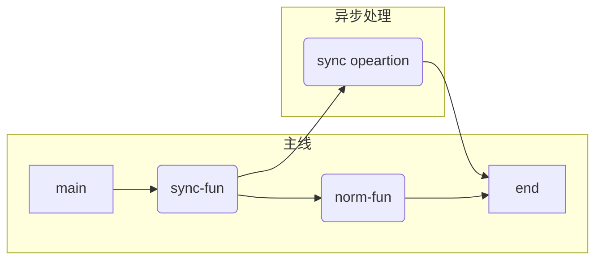
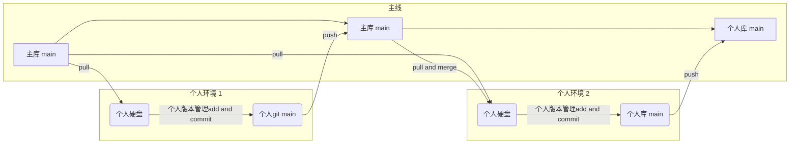

# WILL-2022-04

> :sunglasses: summer is coming ~

[toc]

## Learned

### 开源协议

参考：https://zhuanlan.zhihu.com/p/51331026


### Git 本地项目绑定到远程仓库

1. 新建文件夹
2. 终端打开到这个文件夹里
3. git init
4. git remote add origin 仓库连接【https、ssl、都行】
5.

### git push 到指定分支

首先要下载指定分支：

```
git clone -b 【分支名】 【仓库连接】
```

修改过后，还是那三连：

```
git status
git add .
git commit -m"测试提交"
```

然后 push 到指定分支

```
git push
```

### vscode 自定义快捷提示输入

比如在 vue 里想 vueinit 就生成基本的 setup 语法糖和 template 模板

首先打开这个：


然后选：New Global 那个

下面代码粘到大括号里：（然后保存重启 vscode 即可！）

```

    "vueinit": {
        "scope": "vue",
        "prefix": "vueinit",
        "body": [
            "<script setup lang=\"ts\">",

            "</script>",
            "<template>",

            "</template>"
        ],
        "description": "vue3 setup template"
    }
```

### 非常舒服的 vscode npm 项目视图

改装及使用步骤：（这么改因为，正常启动在左边，停止在右边，隔的很远，太难受了）


### 终端快捷 用 vscode 打开当前目录

Win 可以直接：

```
code .
```

mac 需要配置一下

1. F1
2. 输入 shell
3. 选在 command 里加 code 命令那个
4. 确认
5. mac 也能愉快的在终端打开 vscode 了~

### mac 查看最近打开的文件夹 智能文件夹

如图，右键，选择


照着选就行，保存到哪都行，之后左侧 侧边栏就有了，随时用随时点~


### yum 安装软件 404

总结为来自阿里的背刺，居然给镜像取消了。。先覆盖内容，然后重新配置就好了，就两步

1. 根据自己的系统百度，我是 7 所以 查：centos 7 CentOS-Base.repo
2. 然后找内容挨个试，先复制粘贴，覆盖 CentOS-Base.repo 里面的文字
3. 挨个运行下面的命令：想知道啥意思自己百度

```
yum clean all
rm -rf  /var/cache/yum/
yum makecache
```

下面是我的操作：

1. 覆盖配置文件内容：于是用中科大的镜像，下面内容覆盖/etc/yum.repos.d/CentOS-Base.repo

```

[base]
name=CentOS-$releasever - Base
#mirrorlist=http://mirrorlist.centos.org/?release=$releasever&arch=$basearch&repo=os
baseurl=http://mirrors.neusoft.edu.cn/centos/7/os/$basearch/
gpgcheck=1
gpgkey=file:///etc/pki/rpm-gpg/RPM-GPG-KEY-CentOS-7

#released updates
[updates]
name=CentOS-$releasever - Updates
#mirrorlist=http://mirrorlist.centos.org/?release=$releasever&arch=$basearch&repo=updates
baseurl=http://mirrors.neusoft.edu.cn/centos/7/updates/$basearch/
gpgcheck=1
gpgkey=file:///etc/pki/rpm-gpg/RPM-GPG-KEY-CentOS-7

#additional packages that may be useful
[extras]
name=CentOS-$releasever - Extras
#mirrorlist=http://mirrorlist.centos.org/?release=$releasever&arch=$basearch&repo=extras
baseurl=http://mirrors.neusoft.edu.cn/centos/7/extras/$basearch/
gpgcheck=1
gpgkey=file:///etc/pki/rpm-gpg/RPM-GPG-KEY-CentOS-7

#additional packages that extend functionality of existing packages
[centosplus]
name=CentOS-$releasever - Plus
#mirrorlist=http://mirrorlist.centos.org/?release=$releasever&arch=$basearch&repo=centosplus
baseurl=http://mirrors.neusoft.edu.cn/centos/7/centosplus/$basearch/
gpgcheck=1
enabled=0
gpgkey=file:///etc/pki/rpm-gpg/RPM-GPG-KEY-CentOS-7

#contrib - packages by Centos Users
[contrib]
name=CentOS-$releasever - Contrib
#mirrorlist=http://mirrorlist.centos.org/?release=$releasever&arch=$basearch&repo=contrib
baseurl=http://mirrors.neusoft.edu.cn/centos/7/contrib/$basearch/
gpgcheck=1
enabled=0
gpgkey=file:///etc/pki/rpm-gpg/RPM-GPG-KEY-CentOS-7
```

原先内容：

```
# CentOS-Base.repo
#
# The mirror system uses the connecting IP address of the client and the
# update status of each mirror to pick mirrors that are updated to and
# geographically close to the client.  You should use this for CentOS updates
# unless you are manually picking other mirrors.
#
# If the mirrorlist= does not work for you, as a fall back you can try the
# remarked out baseurl= line instead.
#
#

[base]
name=CentOS-$releasever - Base - mirrors.aliyun.com
#failovermethod=priority
baseurl=https://mirrors.aliyun.com/centos/$releasever/BaseOS/$basearch/os/
        http://mirrors.aliyuncs.com/centos/$releasever/BaseOS/$basearch/os/
        http://mirrors.cloud.aliyuncs.com/centos/$releasever/BaseOS/$basearch/os/
gpgcheck=1
gpgkey=https://mirrors.aliyun.com/centos/RPM-GPG-KEY-CentOS-Official

#additional packages that may be useful
[extras]
name=CentOS-$releasever - Extras - mirrors.aliyun.com
#failovermethod=priority
baseurl=https://mirrors.aliyun.com/centos/$releasever/extras/$basearch/os/
        http://mirrors.aliyuncs.com/centos/$releasever/extras/$basearch/os/
        http://mirrors.cloud.aliyuncs.com/centos/$releasever/extras/$basearch/os/
gpgcheck=1
gpgkey=https://mirrors.aliyun.com/centos/RPM-GPG-KEY-CentOS-Official

#additional packages that extend functionality of existing packages
[centosplus]
name=CentOS-$releasever - Plus - mirrors.aliyun.com
#failovermethod=priority
baseurl=https://mirrors.aliyun.com/centos/$releasever/centosplus/$basearch/os/
        http://mirrors.aliyuncs.com/centos/$releasever/centosplus/$basearch/os/
        http://mirrors.cloud.aliyuncs.com/centos/$releasever/centosplus/$basearch/os/
gpgcheck=1
enabled=0
gpgkey=https://mirrors.aliyun.com/centos/RPM-GPG-KEY-CentOS-Official

[PowerTools]
name=CentOS-$releasever - PowerTools - mirrors.aliyun.com
#failovermethod=priority
baseurl=https://mirrors.aliyun.com/centos/$releasever/PowerTools/$basearch/os/
        http://mirrors.aliyuncs.com/centos/$releasever/PowerTools/$basearch/os/
        http://mirrors.cloud.aliyuncs.com/centos/$releasever/PowerTools/$basearch/os/
gpgcheck=1
enabled=0
gpgkey=https://mirrors.aliyun.com/centos/RPM-GPG-KEY-CentOS-Official


[AppStream]
name=CentOS-$releasever - AppStream - mirrors.aliyun.com
#failovermethod=priority
baseurl=https://mirrors.aliyun.com/centos/$releasever/AppStream/$basearch/os/
        http://mirrors.aliyuncs.com/centos/$releasever/AppStream/$basearch/os/
        http://mirrors.cloud.aliyuncs.com/centos/$releasever/AppStream/$basearch/os/
gpgcheck=1
gpgkey=https://mirrors.aliyun.com/centos/RPM-GPG-KEY-CentOS-Official

```

### Linux 安装 maven

官网下载 maven：https://maven.apache.org/download.cgi

哪个新下哪个，工具嘛：[apache-maven-3.8.5-bin.tar.gz](https://dlcdn.apache.org/maven/maven-3/3.8.5/binaries/apache-maven-3.8.5-bin.tar.gz)

下载完，扔到服务器上

```
解压
tar -zxf 你上传的压缩包

移动
mv 你解压出来的文件夹 /usr/local/maven

配置，在/etc/profile文件最后写：
# maven
export MAVEN_HOME=/usr/local/maven
export PATH=$PATH:$MAVEN_HOME/bin


使配置生效：
source /etc/profile

查看版本：
mvn -v

```

### Linux 上安装 jdk java

查看 Linux 内核版本

```
arch
```

根据内核版本下载：

https://www.oracle.com/java/technologies/downloads/#java17

下好了传到 Linux 上

```
解压
tar -zxvf 你上传的压缩包名

移动到系统配置文件夹里
mv 你解压出来的目录 /usr/local/java

配置，在/etc/profile文件中最后写：
# java
export JAVA_HOME=/usr/local/java
export PATH=$PATH:$JAVA_HOME/bin
export CLASSPATH=.:$JAVA_HOME/lib/dt.jar:$JAVA_HOME/lib/tools.jar
export JRE_HOME=$JAVA_HOME/jre

使配置生效：
source /etc/profile

查看java版本：
java -version

看见下面的就是好了~
java version "17.0.3" 2022-04-19 LTS
Java(TM) SE Runtime Environment (build 17.0.3+8-LTS-111)
Java HotSpot(TM) 64-Bit Server VM (build 17.0.3+8-LTS-111, mixed mode, sharing)

```

出问题了。。不能用 java17。。所以还是下个 11 吧

```
下载
wget https://download.java.net/openjdk/jdk11/ri/openjdk-11+28_linux-x64_bin.tar.gz

解压
tar -xzvf jdk-11.0.14_linux-x64_bin.tar.gz

编辑文件，并添加下面那4行
vim /etc/profile

export JAVA_HOME=/usr/local/java
export PATH=$PATH:$JAVA_HOME/bin
export CLASSPATH=.:$JAVA_HOME/lib/dt.jar:$JAVA_HOME/lib/tools.jar
export JRE_HOME=$JAVA_HOME/jre

刷新配置
source /etc/profile

查看java版本：
java -version
```

参考：https://www.cnblogs.com/zhoujianyi/p/14753325.html

### electron 安装失败

解决方法：将 electron 下载地址指向淘宝镜像

```
npm config set electron_mirror “https://npm.taobao.org/mirrors/electron/”
pnpm config set electron_mirror https://npm.taobao.org/mirrors/electron/
```

### TSX 还是 template

在看 ui 框架源码的时候，是 tsx 写的，考虑是不是也要 follow 一下，其实不然，一般业务没有那么重的组件切换需求

如果也是类似 ui 项目，那 tsx 可能是非常好的选择

参考：为什么 Vue3 的组件库都在使用 jsx/tsx？ - 陈嘉涵的回答 - 知乎 https://www.zhihu.com/question/436260027/answer/1647182157

> 总的来说：
>
> Composition API + template 是最具性价比的选择，
>
> Composition API + JSX 是某些场景下追求极致的选择，相应地需要付出更多开发成本。

### Mac 下输出目录结构 tree

就类似这种

```
.
├── App.vue
├── assets
│   ├── css
│   ├── img
│   └── logo.png
├── common
│   ├── const.js
│   ├── mixin.js
│   └── utils.js
├── components
│   ├── common
│   └── content
├── main.js
├── network
├── router
├── store
└── views
    ├── category
    └── home

```

[推荐先关闭 brew 自动更新](# Mac 关闭 brew 自动更新)

```
使用brew包管理工具安装tree，有点慢还可能失败多试试吧
> brew install tree

安好了吗，我安了好有四五遍，然后看一下都有啥功能
> tree --help

（不建议）直接tree。。万一目录太深...
```

使用 tree 会弹窗，同意就好了：


常用技巧

我们可以在目录遍历时使用 -L 参数指定遍历层级

    tree -L 2

如果你想把一个目录的结构树导出到文件 Readme.md ,可以这样操作

    tree -L 2 >README.md //然后我们看下当前目录下的 README.md 文件

只显示文件夹；

    tree -d

显示项目的层级，n 表示层级数。例：显示项目三层结构，tree -l 3；

    tree -L n

参考：https://blog.csdn.net/weixin_46351593/article/details/113780899

### Mac 关闭 brew 自动更新

```
打开~目录
> cd

打开bash或者zsh配置文件，我的是zsh所以如下，如果是bash把zsh换成bash就行
> open .zshrc

把下面两行加进去，保存关闭文件
# 取消 brew 自动更新
export HOMEBREW_NO_AUTO_UPDATE=true

使配置起效
> zsh

这就ok咯~
```

### TS 使用好习惯

写函数的参数时候，必须带上类型

### tar.gz 与 zip 的区别

我们下载文件的时候一般有时候会让我们选择 tar.gz 还是.zip，你是不是一样也迟疑选择下载那个？

tar.gz 压缩格式用于 unix 的操作系统,而 zip 用于 windows 的操作系统,但在 windows 系统中 WinRar 工具同样可以解压缩 tar.gz 格式的。这下好了，不用再对下载那个文件而迟疑了。

### 域名 注册及备案过程

> 以下过程你甚至不需要百度，直接上阿里云或腾讯云 的搜索栏里搜 **域名注册**，好日汁不远了！

1. 选购
2. 实名认证，3 天后才可以备案
3. 备案填写、提交
4. 等待备案成功（15 天到 30 天）
5. dns 解析
6. https 申请

### js 为什么不让用 var

var 现在不是不可以写了，而是你写业务的时候，基本都是 局部的，你用 var 去影响全局，就应该是被禁止的

而做框架的这个倒是经常要写以便全局可用

### git auto 脚本

```
#! /bin/zsh


#############################
# constants
log_head=">>"
# emoji=""


#############################
# select project
echo "
$log_head 选择项目:
    1) steppp
    2) will
    *) noti(默认,反正只是gitee私有项目)
"
read project_flag

steppp_dir="/Library/code/projects/my_now/steppp"
will_dir="/Users/wangxiansheng/Documents/notes/0_1_will"
noti_dir="/Library/code/projects/my_now/notia"

case $project_flag in
    1) project_dir=$steppp_dir
    ;;
    2) project_dir=$will_dir
    ;;
    *) project_dir=$noti_dir
    ;;
esac

cd $project_dir

# 空行
echo ${br/* /}

#############################
# status
git_status=`git status | tail -1`
echo "git_status: $git_status"

if [[ $git_status == *clean ]]
then
    printf "\nnothing new ~\n"
    exit
fi

#############################
# config type & msg
echo "$log_head 提交格式: <type>: <subject/msg>
type(必须)
    1)dev: 开发功能(这个不是Angular官方的)
    2)will: 学习文档更新(这也不是Angular的)
    *)anyway: 随便输入代码,反正我就是要提交
subject/msg(必须)
    subject是commit目的的简短描述,不超过50个字符。
    结尾不加句号或其他标点符号。
"

type1="dev"
type2="will"
# 诶！就是要提交！
type9="anyway"

echo "$log_head type:(请输入typeflag,1 or 2)"
read type_flag
case $type_flag in
    1) type=$type1
    ;;
    2) type=$type2
    ;;
    *) type=$type9
    ;;
esac

echo "$log_head subject/msg: (请输入提交说明)"
read msg

#############################
# pull


#############################
# add & commit
echo "\n提交信息: $type (_): $msg"
git add .
git commit -m "$type (_): $msg"

#############################
# push
printf "\n$log_head push start ! (default push to gitee)\n"
git push
case $project_flag in
    1) git push github | echo "\n$log_head push github start !(如果卡住,手动github~)"
    ;;
    2) git push github | echo "\n$log_head push github start !(如果卡住,手动github~)"
    ;;
    *) echo "\n$log_head all done !"
    ;;
esac

```

### git commit 格式规范

Angular 规范
commit message 格式

<type>(<scope>): <subject>

type(必须)
用于说明 git commit 的类别，只允许使用下面的标识。

feat：新功能（feature）
fix/to：修复 bug，可以是 QA 发现的 BUG，也可以是研发自己发现的 BUG。
fix：产生 diff 并自动修复此问题。适合于一次提交直接修复问题
to：只产生 diff 不自动修复此问题。适合于多次提交。最终修复问题提交时使用 fix
docs：文档（documentation）。
style：格式（不影响代码运行的变动）。
refactor：重构（即不是新增功能，也不是修改 bug 的代码变动）。
perf：优化相关，比如提升性能、体验。
test：增加测试。
chore：构建过程或辅助工具的变动。
revert：回滚到上一个版本。
merge：代码合并。
sync：同步主线或分支的 Bug。

scope(可选)
scope 用于说明 commit 影响的范围，比如数据层、控制层、视图层等等，视项目不同而不同。
例如在 Angular，可以是 location，browser，compile，compile，rootScope， ngHref，ngClick，ngView 等。如果你的修改影响了不止一个 scope，你可以使用\*代替。

subject(必须)
subject 是 commit 目的的简短描述，不超过 50 个字符。
建议使用中文（感觉中国人用中文描述问题能更清楚一些）。
结尾不加句号或其他标点符号。

### tarui 初体验

参考：https://www.jianshu.com/p/71a4054e0b58

这个类似 electron，打包大小胎心动了！

安装过程，略长，徐耐心、、、

```
假设有node环境，么有rust环境~

1. 创建项目
> yarn create @umijs/umi-app

安装依赖
> yarn

安装rust环境
> curl --proto '=https' --tlsv1.2 -sSf https://sh.rustup.rs | sh

上一步会显示：
1) Proceed with installation (default)
2) Customize installation
3) Cancel installation
输入1即可：
> 1

然后又是漫长的等待...
最后显示 Rust is installed now. Great! 就是好了
继续梭哈：
> source $HOME/.cargo/env

这就算配置好了，查看版本，看好是 rustc ccccccc带上c，无语。。。找了半天，以为安装错位置了
> rustc -V

查看包管理器
> cargo -V

注意：使用vscode编辑rust时需要安装c/c++扩展才能正常启动调试器

全局安装rust打包工具，在这个过程中可能会报某些包没有，不要慌，缺什么就安装什么。。。这个也挺慢的...开封菜这wifi太慢了，用流量，芜湖！起飞！
> cargo install tauri-bundler --force

5分钟终于搞定了：
    Finished release [optimized] target(s) in 5m 57s
  Installing /Users/wangxiansheng/.cargo/bin/cargo-tauri-bundler
   Installed package `tauri-bundler v0.9.4` (executable `cargo-tauri-bundler`)
```

使用 wifi 和流量下载速度对比：

使用 tauri

```
在直接在当前项目下 执行
> yarn add tauri -S
或者
> npm install tauri -S

初始化..一样，初始化过程中，如果报错缺少什么模块，缺什么装什么。。这个也很慢。。这个真的非常非常慢！！
> npx tauri init

输出如下：
[tauri]: running init
? What is your app name? tauri-001
? What should the window title be? tauri-test-001
? What is the url of your dev server? http://localhost:4000
? Where are your web assets (HTML/CSS/JS) located, relative to the "<current dir>/src-tauri" folder that will be created? ../di
st
 dependency:manager Installing missing dependencies... +0ms
 dependency:cargo-commands "tauri-bundler" is already installed +2s
 app:spawn [sync] Running "cargo generate-lockfile" +3ms

    Updating crates.io index

等了好一会告诉我没网了：
warning: spurious network error (2 tries remaining): SecureTransport error: connection closed via error; class=Net (12)


执行完成，会自动生成一个 rust 项目 src-tauri
src-tauri/tauri.conf.json文件内容：
  "build": {
      "distDir": "../build", //打包后的路径
      "devPath": "http://localhost:8080", // 此为 dev 启动时的url
      "beforeDevCommand": "",
      "beforeBuildCommand": ""
    },
配置package.json
  scripts:{
    ...
    "start": "concurrently \"npm run start:web\"  \"npm run start:tauri\"",
    "start:web": "umi dev",
    "start:tauri": "tauri dev",
    "build": "npm run build:web &&  npm run build:tauri",
    "build:web": "umi build",
    "build:tauri": "tauri build",
    ...
  }

再按一次依赖 npm就npm i 用yarn就yarn

依赖安装运行..这时，cargo 会给 rust 项目安装依赖。过程会比较慢，有可能会因为网络问题导致安装失败，不要慌，多尝试几次。安装完成后。ctrl+c 推出，然后再使用 npm run start 一次性启动整个项目
> npm run start:tauri
```

### git 同步合并代码

clone 或 folk 仓库后，进行本地和远程绑定

```
首先同步设置项目的 upstream 仓库
> git remote add gitee-upstream https://github.com/TuSimple/naive-ui.git

# 拉取 upstream 仓库 main 分支最新代码
> git fetch gitee-upstream main

# 切换分支
> git checkout main

# 合并 main 分支最新代码到本地当前分支
> git merge upstream/main

```


### win 双版本 多版本 nodejs

全体目光像我看齐哈！步骤不能乱！

1. 安装 nvm 先，点开https://github.com/coreybutler/nvm-windows/releases 下载 nvm-setup.zip
2. 无脑安装，然后运行 where nvm 或者 nvm root 看一下 nvm 的安装目录
3. 去下载你想要的那几个版本的 nodejs https://nodejs.org/dist/
4. 无脑安装一个，安装完，目录应该会找哈，where node 命令就能找到
5. 然后把那个 nodejs 文件夹，重命名，格式`v0.0.0` **格式不能错！** 然后放到 nvm 的目录里
6. 以此类推，把其他的版本都安装上，改名，放 nvm 目录
7. 都放好了，nvm 目录应该是这样的
   
8. 然后 nvm list 可以查看当前有哪些版本
9. nvm use 0.0.0 切换到指定版本。**一定要用 admin 的 shell 不管是你 cmd 还是 powershell，一定要在管理员模式下！！！**
10. 显示 Now using node v10.16.3 (64-bit) ，就 ok 了

常用命令

```
查看当前node 版本
> nvm list

切换版本
> nvm use [version]

默认nvm根目录
> nvm root

```

### sh 命令后无法退出

输入 exit 即可，而不是 q

### git 自动提交脚本

先运行 whereis bash，我用的是 zsh 所以运行的是 where is zsh，然后会输出 运行正常的地址 `bin/bash`或 `/bin/zsh` ，这就是下面第一行的内容

提交时，只需运行命令 sh ./gitbash.sh '提交描述信息'

**补充说明：**

1、#! /bin/bash，声明脚本解释执行的方式，必须写在第一行；
2、运行报错，找不到 sh 命令如何解决？首先确保已正确安装好 git 工具，在 git 安装目录下有一个 bin 文件夹，里面找到 sh.exe，在系统环境变量中添加相对应的环境，如 C:\Program Files\Git\bin
3、一般 shell 的变量赋值的时候不用带“\$”，$1 值为 _sh ./gitbash.sh '提交描述信息'_ 命令的第一个参数

在~目录创建文件，文件名自己定就好。。我是叫 git-auto.sh，内容如下

```
#! /bin/zsh

# 运行
# sh ./gitbash.sh '提交描述信息'

echo "请输入工程目录："
read project_dir
cd project_dir

git status

git add .

echo "请输入提交说明："
read msg
git commit -m msg

git push

# 空行
# echo ${br/* /}

echo "如果是will和steppp项目再git push gitee即可"


```

## funs

### 为什么要出门学习


### mac 满电 却显示没电了

这就是惯的，打两下就好了（bushi

看网上有这样的

第一步：重启后按 D 键检查计算机硬件情况（该步骤需连接电源线），没有问题进入第二步；

第二步：关机，按 Shift+Control+Option+关机键，持续 15 秒，属于放电过程，电脑屏幕不会有任何显示；

第三步：，电脑处于关机状态，点击开机键后，迅速按住 Option+Command+R+P，持续 25 秒后，等待电脑开机即可。

总结就是，冷加老化

方法：温暖它 or 换新的

### 要看的、收藏的网站太多了 怎么办

火狐浏览器可以一键打开一个收藏夹里的所有网页，平时没看完的、或者想看的 都直接收藏进去

我的那个文件夹起名就叫 temp 就是临时的意思

之后，如果攒的很多了，需要滚动了（大概有几十个了吧），那就一键打开全部，再清空这个文件夹

然后挨个看就好了，还是很喜欢的文章就再收藏进来（相信我这种概率，经过时间的洗涤，会很低的，大概只有 1/10 的网站值得你删掉再收藏）

### 有关文件夹分类

有各种分类方式，有的按照学习、生活、工作分，有的按照项目分、有的按照时间分

我现在认为，最好的分类还是一级用时间、二级用项目，然后适当的在项目中插入标签（学习、生活、工作啥的）

类似这样的一个目录：(或者也可以将 now 里面的项目放到顶级目录中，不放在 now 里)

1. **现在 - now**
    1. 项目 1
        1. 文档 1
    2. 项目 2
        1. 文档 1
    3. ...
2. **临时 - temp**
    1. xxx
    2. yyy
    3. ...
3. **归档 - Archive**
    1. 2022-04
        1. 项目 a
        2. 项目 b
        3. ...
    2. 2022-03
        1. 项目 c
        2. 项目 d
        3. ...
    3. ...

### kfc 奇遇记

又看到奇怪的人，一个大妈疯狂打扫别人吃过的东西，是真的吃的和包装都收入囊中

然后还会很好的收拾。。不过，这多少是...了点

### 圣诞节事件

https://www.uisdc.com/ant-design-ui-attack

**Ant Design 慎用**。。。还挺搞笑的，可以了解一下：[antd 组件的圣诞节彩蛋事件](https://www.jianshu.com/p/24e39e97ae8f)

### 随机图片

https://picsum.photos/1920/1080?random

### Mac 安装一个视频管理系统 stashapp/stash

go 写的工具，挺有意思的：

1. 去主页下载对应的程序https://github.com/stashapp/stash

2. 我是 Mac，18 年买的，因特尔内核所以下载 stash-macos-intel

3. 然后到下载好的程序所在目录运行下面命令即可

    ```
    chmod +x stash-macos-applesilicon
    ./stash-macos-applesilicon
    ```

4. 然后根据 output 访问即可，应该是 http://localhost:9999/

提示：如果关了终端，程序也就停止了

Mac 安装参考：https://github.com/stashapp/stash/discussions/2362

### 突然想到 Typora 可以写异步的效果图，用...

这个特殊语法：（写的有点乱，大概是这意思）



有点类似 git 管理：每个人电脑里都有完整的版本库,版本库中包含了完整的版本管理数据,例如提交信息,版本变化记录等等...每个开发者都拥有独立的版本库，所以可以直接对自己的版本库进行操作...在离线环境中，开发者既可以连续工作，也可以持续修改，和本地版本库进行交互（比如管理版本、查询修改历史、回溯、提交、……）。这样使得开发者不需要将自己的修改持续送至集中的档案库上，造成其他开发者必须套用这些修改，引起可能的不稳定情况。



### pnpm

这个包管理器不管怎么说，vue 团队在用、naive-ui 团队也在用，还是值得试一下的~

### 程序员是否要跳槽？

一定要跳！如果你是底层的话，你时间久了，就离不开当前的公司了，你学会的大部分是业务，天天写的也是业务代码

可以说是程序业务员了

而且时间久了，技术也会慢慢局限在业务需求内，如果分不到好的工作内容，那么基本就是 35 前拜拜那一队人了

如果公司业务好，那可以，如果发展未知，结果你学了 10 年的业务经验，出去了还是低级技术，很难找到心仪的工作了

2022/4/21 10:10:19 正在工作，越看代码越觉得上面说的对，每天都提交的些什么代码，全是改改参数，都是已有的功能微调而已

### KFC 见闻录

肯德基里有流浪汉看片。。绝了，外放声还很大

到了 6 点多，前台的小哥把他轰走了。。。一个四十左右的男的，看一会眯一会，绝绝子
