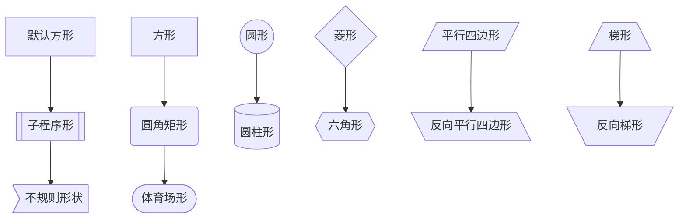
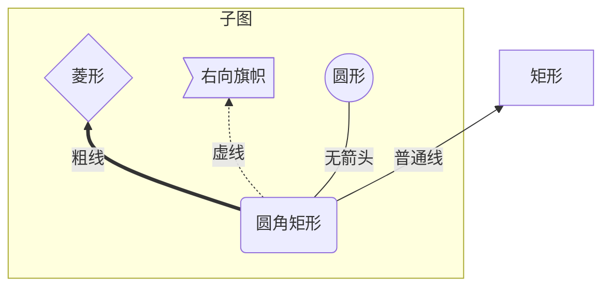
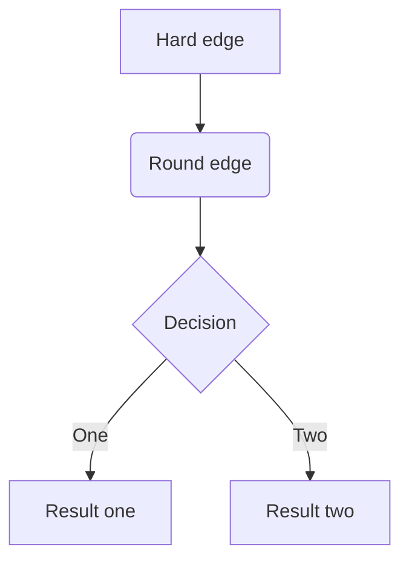
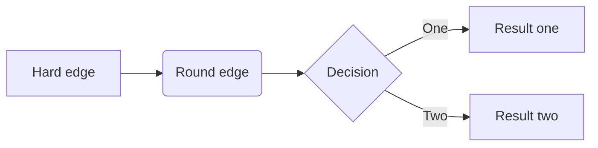

[toc]

## 逻辑相关

参考：

[Markdown 进阶 - Mermaid 绘图](https://zhuanlan.zhihu.com/p/139166407)

[Mermaid从入门到入土——Markdown进阶语法](https://zhuanlan.zhihu.com/p/355997933)

[mermaid中节点文本换行](https://blog.csdn.net/yovven/article/details/101348911)

横版：

