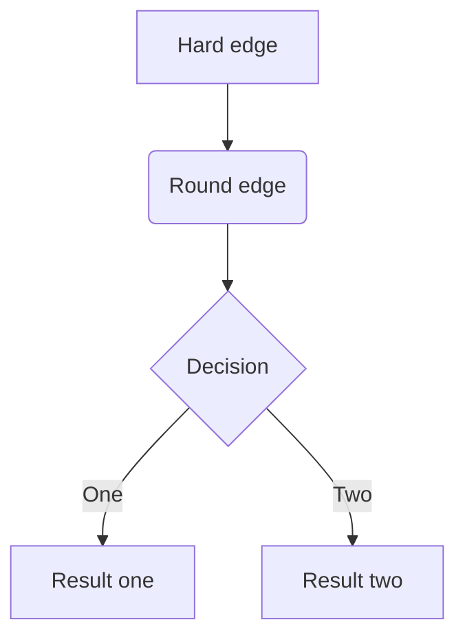
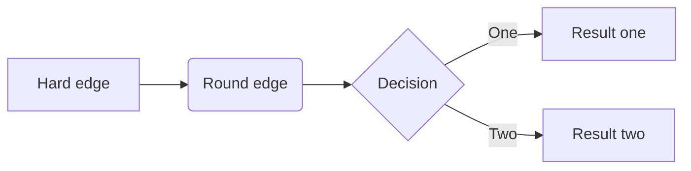
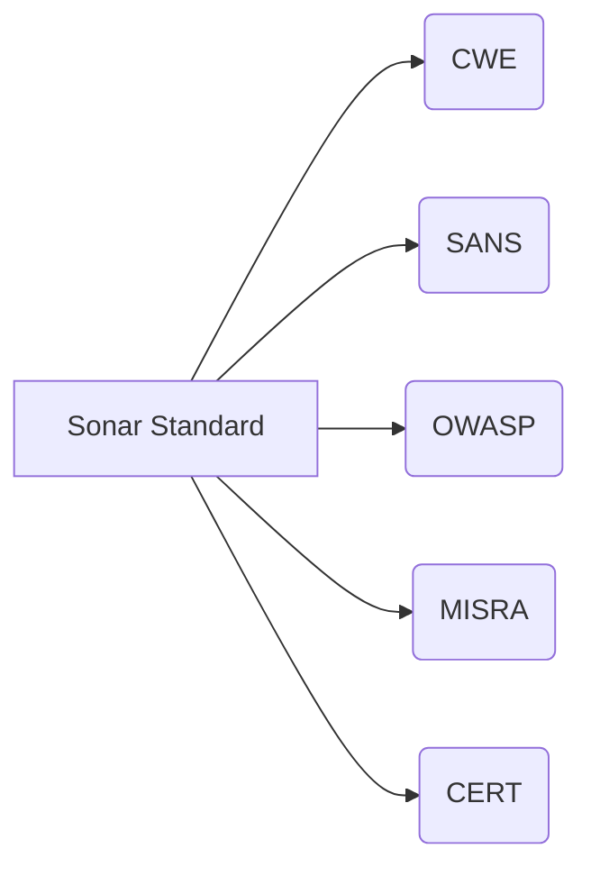

# Markdown语法——逻辑相关

> 乱序，看目录自己找需要的语法
>
> 参考：[Markdown 进阶 - Mermaid 绘图](https://zhuanlan.zhihu.com/p/139166407)
>
> [百度  markdown mermaid](https://www.baidu.com/baidu?tn=monline_7_dg&ie=utf-8&wd=markdown+mermaid)

## 基本语法

Markdown中的流程图语法叫`flow`，该语法只有两个注意事项：

1. 定义元素
2. 连接定义好的元素


## 定义元素

```
tag = type:content:url
```

1. `tag`： 标签，用于连接元素时使用，相当于定义了一个常量
2. `=`：标签定义等式
3. `type`：该标签的类型，共有6种类型如下：

| 元素类型    | 代表意义   |
| ----------- | ---------- |
| start       | 开始       |
| end         | 结束、完成 |
| operation   | 流程操作   |
| subroutine  | 预定子流程 |
| condition   | 条件输出   |
| inputoutput | 输入输出   |

4. `content`：流程语句中放置的内容

- `type`：与**content之间一定要有一个空格**，否则会出问题
- `:`：超链接定义等式
- `url`：指向链接，与流程语句绑定，选填

## 连接元素

使用`-`符号，如：

```
s = start:开始e=end:结束o=operation:操作项s-o-e
```

## 怎么画？

以上面的流程代码为例，在代码块标志后加上`flow`即可：

```
```flow
s=start:开始
e=eng:结束
o=operation:操作项

s-o-e
​```
```

有些MarkDown编辑器，如typora，在你插入代码时选择`flow`语法即可，就只需要输入流程图要用到的代码。

```flow
s=start:开始
e=eng:结束
o=operation:操作项

s-o-e
```


# 操作示例

## 最简单的流程图

以上面的流程图代码为例，我们可以得到这样的流程图

```
开始操作项结束
```

## 闰年判断逻辑

来个复杂点的:

```
```flow
st=start:Start
i=inputoutput:输入年份n
cond1=condition:n能否被4整除？
cond2=condition:n能否被100整除？
cond3=condition:n能否被400整除？
o1=inputoutput:输出非闰年
o2=inputoutput:输出非闰年
o3=inputoutput:输出闰年
o4=inputoutput:输出闰年
e=end

st-i-cond1
cond1(no)-o1-e
cond1(yes)-cond2
cond2(no)-o3-e
cond2(yes)-cond3
cond3(yes)-o2-e
cond3(no)-o4-e
​```
```

得到下面的流程图：

```flow
st=start:Start
i=inputoutput:输入年份n
cond1=condition:n能否被4整除？
cond2=condition:n能否被100整除？
cond3=condition:n能否被400整除？
o1=inputoutput:输出非闰年
o2=inputoutput:输出非闰年
o3=inputoutput:输出闰年
o4=inputoutput:输出闰年
e=end

st-i-cond1
cond1(no)-o1-e
cond1(yes)-cond2
cond2(no)-o3-e
cond2(yes)-cond3
cond3(yes)-o2-e
cond3(no)-o4-e
```





横版：







https://support.typora.io/Draw-Diagrams-With-Markdown/


# Markdown语法——数学相关

> 乱序，看目录自己找需要的语法

## 行列式

​       

# markdown最全数学公式

我们在用markdown写文档时有时候少不了需要插入一些公式，然而markdown公式输入远没有word这么直观，有很多复杂的格式和符号的英语缩写需要记忆，经常是刚用完，过几天不用又都忘记了，因此在这里将数学公式的Latex编辑方式做一个整理，以方便自己和读者今后使用。

**分数，平方** 

| 算式         | markdown |
| ------------ | -------- |
| 7*x*+51+*y*2 |          |

|      | \frac{7x+5}{1+y^2} |
| ---- | ------------------ |
|      |                    |

**下标** 

| 算式       | markdown |
| ---------- | -------- |
| *z*=*z**l* |          |

|      | z=z_l |
| ---- | ----- |
|      |       |

**省略号** 

| 省略号 | markdown |
| ------ | -------- |
| ⋯      |          |

|      | \cdots |
| ---- | ------ |
|      |        |

**行间公式（使用两个$包含公式可以独立一行）** 

| 行间公式                                                  | markdown |
| --------------------------------------------------------- | -------- |
| *d**d**x**e**a**x*=*a**e**a**x*∑*n**i*=1(*X**i*−*X*⎯⎯⎯⎯)2 |          |

|      | `$\frac{d}{dx}e^{ax}=ae^{ax}\quad \sum_{i=1}^{n}{(X_i - \overline{X})^2}$` |
| ---- | ------------------------------------------------------------ |
|      |                                                              |

**开根号** 

| 算式       | markdown |
| ---------- | -------- |
| 2‾√;3‾√*n* |          |

|      | \sqrt{2};\sqrt[n]{3} |
| ---- | -------------------- |
|      |                      |

**矢量** 

| 算式        | markdown |
| ----------- | -------- |
| *a*⃗ ⋅*b*⃗ =0 |          |

|      | \vec{a} \cdot \vec{b}=0 |
| ---- | ----------------------- |
|      |                         |

**微积分** 

| 算式        | markdown |
| ----------- | -------- |
| ∫23*x*2d*x* |          |

|      | \int ^2_3 x^2 {\rm d}x |
| ---- | ---------------------- |
| ∬    |                        |

|      | \iint |
| ---- | ----- |
| ∭    |       |

|      | \iiint |
| ---- | ------ |
| ∮    |        |

|           | \oint |
| --------- | ----- |
| \varoiint |       |

|      | \oint |
| ---- | ----- |
| d    |       |

|      | \mathrm{d} |
| ---- | ---------- |
| ′    |            |

|      | \prime |
| ---- | ------ |
| lim  |        |

|      | \lim |
| ---- | ---- |
| ∞    |      |

|      | \infty |
| ---- | ------ |
| ∂    |        |

|                          | \partial |
| ------------------------ | -------- |
| ∂*f*(*x*,*y*)∂*x*∣∣*x*=0 |          |

|      | \left.\frac{\partial f(x,y)}{\partial x}\right |
| ---- | ---------------------------------------------- |
| ∑    |                                                |

|      | \sum |
| ---- | ---- |
|      |      |

**极限** 

| 算式               | markdown |
| ------------------ | -------- |
| *l**i**m**n*→+∞*n* |          |

|      | \lim_{n\rightarrow+\infty} n |
| ---- | ---------------------------- |
|      |                              |

**累加** 

| 算式   | markdown |
| ------ | -------- |
| ∑1*i*2 |          |

|      | \sum \frac{1}{i^2} |
| ---- | ------------------ |
|      |                    |

**累乘** 

| 算式   | markdown |
| ------ | -------- |
| ∏1*i*2 |          |

|      | \prod \frac{1}{i^2} |
| ---- | ------------------- |
|      |                     |

**给公式编号，如: (1)** 
 `$$e^{i\theta}=cos\theta+\sin\theta i\tag{1}$$` 


*e**i**θ*=*c**o**s**θ*+*i*sin*θ*(1)


**矩阵**


```
$$
\begin{matrix}
1 & 2 & 3 \\
4 & 5 & 6 \\
7 & 8 & 9 
\end{matrix} \tag{1}
$$1234567
```


 

147258369(1)


**带括号的矩阵**


```
$$
\left[
\begin{matrix}
1 & 2 & 3 \\
4 & 5 & 6 \\
7 & 8 & 9 
\end{matrix} \right]\tag{2}
$$12345678
```


 

⎡⎣⎢⎢147258369⎤⎦⎥⎥(2)


| 符号    | 形式     |
| ------- | -------- |
| pmatrix | (1324)   |
| bmatrix | [1324]   |
| Bmatrix | {1324}   |
| vmatrix | ∣∣1324∣∣ |

|         |                 |
| ------- | --------------- |
| Vmatrix | \|\|1 3 2 4\|\| |

**希腊字母** 

| 大写 | markdown | 小写 | markdown    |
| ---- | -------- | ---- | ----------- |
| A    | A        | α    | \alpha      |
| B    | B        | β    | \beta       |
| Γ    | \Gamma   | γ    | \gamma      |
| Δ    | \Delta   | δ    | \delta      |
| E    | E        | ϵ    | \epsilon    |
|      |          | ε    | \varepsilon |
| Z    | Z        | ζ    | \zeta       |
| H    | H        | η    | \eta        |
| Θ    | \Theta   | θ    | \theta      |
| I    | I        | ι    | \iota       |
| K    | K        | κ    | \kappa      |
| Λ    | \Lambda  | λ    | \lambda     |
| M    | M        | μ    | \mu         |
| N    | N        | ν    | \nu         |
| Ξ    | \Xi      | ξ    | \xi         |
| O    | O        | ο    | \omicron    |
| Π    | \Pi      | π    | \pi         |
| P    | P        | ρ    | \rho        |
| Σ    | \Sigma   | σ    | \sigma      |

| 大写 | markdown | 小写 | markdown |
| ---- | -------- | ---- | -------- |
| T    | T        | τ    | \tau     |
| Υ    | \Upsilon | υ    | \upsilon |
| Φ    | \Phi     | ϕ    | \phi     |
|      |          | φ    | \varphi  |
| X    | X        | χ    | \chi     |
| Ψ    | \Psi     | ψ    | \psi     |
| Ω    | \Omega   | ω    | \omega   |

**三角函数** 

| 三角函数 | markdown |
| -------- | -------- |
| sin      | \sin     |

**对数函数** 

**对数函数** 

| 算式 | markdown |
| ---- | -------- |
| ln15 |          |

|              | \ln15 |
| ------------ | ----- |
| *l**o**g*210 |       |

|      | \log_2^{10} |
| ---- | ----------- |
| lg7  |             |

|      | \lg7 |
| ---- | ---- |
|      |      |

**关系运算符** 

| 运算符 | markdown |
| ------ | -------- |
| ±      | \pm      |
| ×      | \times   |
| ÷      | \div     |
| ∑      | \sum     |
| ∏      | \prod    |
| ≠      | \neq     |
| ≤      | \leq     |
| ≥      | \geq     |

**括号**

| 运算符        | markdown            |
| ------------- | ------------------- |
| 大括号: {a+x} | \lbrace a+x \rbrace |
| 尖括号: ⟨*x*⟩ |                     |

|                | \langle x \rangle |
| -------------- | ----------------- |
| 上取整: ⌈*x*2⌉ |                   |

|               | \lceil \frac{x}{2} \rceil |
| ------------- | ------------------------- |
| 下取整: ⌊*x*⌋ |                           |

|                                     | \lfloor x \rfloor |
| ----------------------------------- | ----------------- |
| 原始括号:{∑*n**i*=0*i*2=2*a**x*2+1} |                   |

|                                     | \lbrace \sum_{i=0}^{n}i^{2}=\frac{2a}{x^2+1} \rbrace |
| ----------------------------------- | ---------------------------------------------------- |
| 全包括号:{∑*n**i*=0*i*2=2*a**x*2+1} |                                                      |

|      | \left\lbrace \sum_{i=0}^{n}i^{2}=\frac{2a}{x^2+1} \right\rbrace |
| ---- | ------------------------------------------------------------ |
|      |                                                              |


参考：

[Typora数学公式汇总（Markdown）](https://zhuanlan.zhihu.com/p/261750408?utm_source=wechat_session)


$$
\begin{matrix}
1&x&x^2\\
1&y&y^2\\
1&z&z^2\\
\end{matrix}
$$


$$
X=\left|
	\begin{matrix}
	x_{11} & x_{12} & \cdots & x_{1d}\\
	x_{21} & x_{22} & \cdots & x_{2d}\\
	\vdots & \vdots & \ddots & \vdots\\
	x_{m1} & x_{m2} & \cdots & x_{md} \\
    \end{matrix}
    \right|
$$


$$
\begin{equation}
E=mc^2
\end{equation}
$$


$$
\max \limits_{a<x<b} \Bigg\{f(x)\Bigg\}
$$


$$
f(n) = 
\begin{cases}
n/2, & \text {if $n$ is even}\\
3n+1, & \text {if $n$ is odd}
\end{cases}
$$


$$
\left\{
\begin{array}{c}
	a_1x+b_1y+c_1z=d_1\\
	a_2x+b_2y+c_2z=d_2\\
	a_3x+b_3y+c_3z=d_3
\end{array}
\right.

\\注意right后面有个小数点
$$


$$
\frac{\partial J(\theta)}{\partial\theta_j} = -\frac{1}{m}\sum_{i=0}^m (y^i - h_\theta (x^i))x^i_j
$$


$$
\begin{align}
\frac{\partial J(\theta)}{\partial \theta_j}
& = - \frac{1}{m} \sum_{i=0}^m (y^i-h_\theta(x^i))\frac{\partial}{\partial\theta_j}(y^i-h_\theta(x^i))\\
& = -\frac{1}{m}\sum_{i=0}^m(y^i-h_\theta(x^i))\frac{\partial}{\partial\theta_j}(\sum_{j=0}^n\theta_j x^i_j - y^i)\\
& = - \frac{1}{m}\sum_{i=0}^m(y^i-h_\theta (x^i))x^i_j
\end{align}
$$


