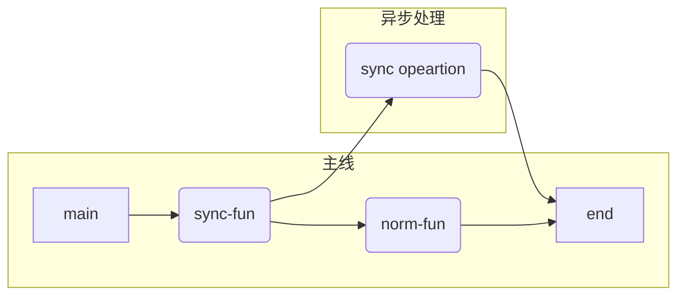
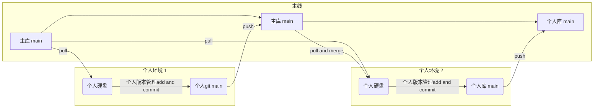

# WILL-2022-04

> :sunglasses: summer is coming ~

[toc]


## Learned


### yum 安装软件 404

总结为来自阿里的背刺，居然给镜像取消了。。先覆盖内容，然后重新配置就好了，就两步

1. 根据自己的系统百度，我是7所以 查：centos 7 CentOS-Base.repo
2. 然后找内容挨个试，先复制粘贴，覆盖CentOS-Base.repo里面的文字
3. 挨个运行下面的命令：想知道啥意思自己百度

```
yum clean all
rm -rf  /var/cache/yum/
yum makecache
```


下面是我的操作：

1. 覆盖配置文件内容：于是用中科大的镜像，下面内容覆盖/etc/yum.repos.d/CentOS-Base.repo

```

[base]
name=CentOS-$releasever - Base
#mirrorlist=http://mirrorlist.centos.org/?release=$releasever&arch=$basearch&repo=os
baseurl=http://mirrors.neusoft.edu.cn/centos/7/os/$basearch/
gpgcheck=1
gpgkey=file:///etc/pki/rpm-gpg/RPM-GPG-KEY-CentOS-7

#released updates 
[updates]
name=CentOS-$releasever - Updates
#mirrorlist=http://mirrorlist.centos.org/?release=$releasever&arch=$basearch&repo=updates
baseurl=http://mirrors.neusoft.edu.cn/centos/7/updates/$basearch/
gpgcheck=1
gpgkey=file:///etc/pki/rpm-gpg/RPM-GPG-KEY-CentOS-7

#additional packages that may be useful
[extras]
name=CentOS-$releasever - Extras
#mirrorlist=http://mirrorlist.centos.org/?release=$releasever&arch=$basearch&repo=extras
baseurl=http://mirrors.neusoft.edu.cn/centos/7/extras/$basearch/
gpgcheck=1
gpgkey=file:///etc/pki/rpm-gpg/RPM-GPG-KEY-CentOS-7

#additional packages that extend functionality of existing packages
[centosplus]
name=CentOS-$releasever - Plus
#mirrorlist=http://mirrorlist.centos.org/?release=$releasever&arch=$basearch&repo=centosplus
baseurl=http://mirrors.neusoft.edu.cn/centos/7/centosplus/$basearch/
gpgcheck=1
enabled=0
gpgkey=file:///etc/pki/rpm-gpg/RPM-GPG-KEY-CentOS-7

#contrib - packages by Centos Users
[contrib]
name=CentOS-$releasever - Contrib
#mirrorlist=http://mirrorlist.centos.org/?release=$releasever&arch=$basearch&repo=contrib
baseurl=http://mirrors.neusoft.edu.cn/centos/7/contrib/$basearch/
gpgcheck=1
enabled=0
gpgkey=file:///etc/pki/rpm-gpg/RPM-GPG-KEY-CentOS-7
```

原先内容：

```
# CentOS-Base.repo
#
# The mirror system uses the connecting IP address of the client and the
# update status of each mirror to pick mirrors that are updated to and
# geographically close to the client.  You should use this for CentOS updates
# unless you are manually picking other mirrors.
#
# If the mirrorlist= does not work for you, as a fall back you can try the 
# remarked out baseurl= line instead.
#
#
 
[base]
name=CentOS-$releasever - Base - mirrors.aliyun.com
#failovermethod=priority
baseurl=https://mirrors.aliyun.com/centos/$releasever/BaseOS/$basearch/os/
        http://mirrors.aliyuncs.com/centos/$releasever/BaseOS/$basearch/os/
        http://mirrors.cloud.aliyuncs.com/centos/$releasever/BaseOS/$basearch/os/
gpgcheck=1
gpgkey=https://mirrors.aliyun.com/centos/RPM-GPG-KEY-CentOS-Official
 
#additional packages that may be useful
[extras]
name=CentOS-$releasever - Extras - mirrors.aliyun.com
#failovermethod=priority
baseurl=https://mirrors.aliyun.com/centos/$releasever/extras/$basearch/os/
        http://mirrors.aliyuncs.com/centos/$releasever/extras/$basearch/os/
        http://mirrors.cloud.aliyuncs.com/centos/$releasever/extras/$basearch/os/
gpgcheck=1
gpgkey=https://mirrors.aliyun.com/centos/RPM-GPG-KEY-CentOS-Official
 
#additional packages that extend functionality of existing packages
[centosplus]
name=CentOS-$releasever - Plus - mirrors.aliyun.com
#failovermethod=priority
baseurl=https://mirrors.aliyun.com/centos/$releasever/centosplus/$basearch/os/
        http://mirrors.aliyuncs.com/centos/$releasever/centosplus/$basearch/os/
        http://mirrors.cloud.aliyuncs.com/centos/$releasever/centosplus/$basearch/os/
gpgcheck=1
enabled=0
gpgkey=https://mirrors.aliyun.com/centos/RPM-GPG-KEY-CentOS-Official
 
[PowerTools]
name=CentOS-$releasever - PowerTools - mirrors.aliyun.com
#failovermethod=priority
baseurl=https://mirrors.aliyun.com/centos/$releasever/PowerTools/$basearch/os/
        http://mirrors.aliyuncs.com/centos/$releasever/PowerTools/$basearch/os/
        http://mirrors.cloud.aliyuncs.com/centos/$releasever/PowerTools/$basearch/os/
gpgcheck=1
enabled=0
gpgkey=https://mirrors.aliyun.com/centos/RPM-GPG-KEY-CentOS-Official


[AppStream]
name=CentOS-$releasever - AppStream - mirrors.aliyun.com
#failovermethod=priority
baseurl=https://mirrors.aliyun.com/centos/$releasever/AppStream/$basearch/os/
        http://mirrors.aliyuncs.com/centos/$releasever/AppStream/$basearch/os/
        http://mirrors.cloud.aliyuncs.com/centos/$releasever/AppStream/$basearch/os/
gpgcheck=1
gpgkey=https://mirrors.aliyun.com/centos/RPM-GPG-KEY-CentOS-Official

```


### Linux安装maven

官网下载maven：https://maven.apache.org/download.cgi

哪个新下哪个，工具嘛：[apache-maven-3.8.5-bin.tar.gz](https://dlcdn.apache.org/maven/maven-3/3.8.5/binaries/apache-maven-3.8.5-bin.tar.gz)

下载完，扔到服务器上

```
解压
tar -zxf 你上传的压缩包

移动
mv 你解压出来的文件夹 /usr/local/maven

配置，在/etc/profile文件最后写：
# maven
export MAVEN_HOME=/usr/local/maven
export PATH=$PATH:$MAVEN_HOME/bin


使配置生效：
source /etc/profile

查看版本：
mvn -v

```


### Linux 上安装jdk java

查看Linux内核版本

```
arch
```

根据内核版本下载：

https://www.oracle.com/java/technologies/downloads/#java17

下好了传到Linux上

```
解压
tar -zxvf 你上传的压缩包名

移动到系统配置文件夹里
mv 你解压出来的目录 /usr/local/java

配置，在/etc/profile文件中最后写：
# java
export JAVA_HOME=/usr/local/java
export PATH=$PATH:$JAVA_HOME/bin
export CLASSPATH=.:$JAVA_HOME/lib/dt.jar:$JAVA_HOME/lib/tools.jar
export JRE_HOME=$JAVA_HOME/jre

使配置生效：
source /etc/profile

查看java版本：
java -version

看见下面的就是好了~
java version "17.0.3" 2022-04-19 LTS
Java(TM) SE Runtime Environment (build 17.0.3+8-LTS-111)
Java HotSpot(TM) 64-Bit Server VM (build 17.0.3+8-LTS-111, mixed mode, sharing)

```


出问题了。。不能用java17。。所以还是下个11吧

```
下载
wget https://download.java.net/openjdk/jdk11/ri/openjdk-11+28_linux-x64_bin.tar.gz

解压
tar -xzvf jdk-11.0.14_linux-x64_bin.tar.gz

编辑文件，并添加下面那4行
vim /etc/profile

export JAVA_HOME=/usr/local/java
export PATH=$PATH:$JAVA_HOME/bin
export CLASSPATH=.:$JAVA_HOME/lib/dt.jar:$JAVA_HOME/lib/tools.jar
export JRE_HOME=$JAVA_HOME/jre

刷新配置
source /etc/profile

查看java版本：
java -version
```


参考：https://www.cnblogs.com/zhoujianyi/p/14753325.html


### electron 安装失败

解决方法：将electron下载地址指向淘宝镜像

```
npm config set electron_mirror “https://npm.taobao.org/mirrors/electron/”
pnpm config set electron_mirror https://npm.taobao.org/mirrors/electron/
```


### TSX还是template

在看ui框架源码的时候，是tsx写的，考虑是不是也要follow一下，其实不然，一般业务没有那么重的组件切换需求

如果也是类似ui项目，那tsx可能是非常好的选择


参考：为什么 Vue3 的组件库都在使用 jsx/tsx？ - 陈嘉涵的回答 - 知乎 https://www.zhihu.com/question/436260027/answer/1647182157 

> 总的来说：
>
> Composition API + template 是最具性价比的选择，
>
> Composition API + JSX 是某些场景下追求极致的选择，相应地需要付出更多开发成本。


### Mac下输出目录结构 tree

就类似这种

```
.
├── App.vue
├── assets
│   ├── css
│   ├── img
│   └── logo.png
├── common
│   ├── const.js
│   ├── mixin.js
│   └── utils.js
├── components
│   ├── common
│   └── content
├── main.js
├── network
├── router
├── store
└── views
    ├── category
    └── home

```

[推荐先关闭brew自动更新](#  Mac 关闭brew自动更新) 

```
使用brew包管理工具安装tree，有点慢还可能失败多试试吧
> brew install tree

安好了吗，我安了好有四五遍，然后看一下都有啥功能
> tree --help

（不建议）直接tree。。万一目录太深...
```

使用tree会弹窗，同意就好了：


常用技巧

我们可以在目录遍历时使用 -L 参数指定遍历层级

    tree -L 2

如果你想把一个目录的结构树导出到文件 Readme.md ,可以这样操作

    tree -L 2 >README.md //然后我们看下当前目录下的 README.md 文件

只显示文件夹；

    tree -d 

显示项目的层级，n表示层级数。例：显示项目三层结构，tree -l 3；

    tree -L n 


参考：https://blog.csdn.net/weixin_46351593/article/details/113780899


### Mac 关闭brew自动更新

```
打开~目录
> cd

打开bash或者zsh配置文件，我的是zsh所以如下，如果是bash把zsh换成bash就行
> open .zshrc

把下面两行加进去，保存关闭文件
# 取消 brew 自动更新
export HOMEBREW_NO_AUTO_UPDATE=true

使配置起效
> zsh

这就ok咯~
```


### TS 使用好习惯

写函数的参数时候，必须带上类型


### tar.gz与zip的区别

我们下载文件的时候一般有时候会让我们选择 tar.gz还是.zip，你是不是一样也迟疑选择下载那个？

tar.gz压缩格式用于unix的操作系统,而zip用于windows的操作系统,但在windows系统中WinRar工具同样可以解压缩tar.gz格式的。这下好了，不用再对下载那个文件而迟疑了。


### 域名 注册及备案过程

> 以下过程你甚至不需要百度，直接上阿里云或腾讯云 的搜索栏里搜 **域名注册**，好日汁不远了！

1. 选购
2. 实名认证，3天后才可以备案
3. 备案填写、提交
4. 等待备案成功（15天到30天）
5. dns解析
6. https申请


### js 为什么不让用var

var现在不是不可以写了，而是你写业务的时候，基本都是 局部的，你用var去影响全局，就应该是被禁止的

而做框架的这个倒是经常要写以便全局可用


### git auto 脚本

```
```


### git commit 格式规范

Angular规范
commit message格式

<type>(<scope>): <subject>

type(必须)
用于说明git commit的类别，只允许使用下面的标识。

feat：新功能（feature）
fix/to：修复bug，可以是QA发现的BUG，也可以是研发自己发现的BUG。
fix：产生diff并自动修复此问题。适合于一次提交直接修复问题
to：只产生diff不自动修复此问题。适合于多次提交。最终修复问题提交时使用fix
docs：文档（documentation）。
style：格式（不影响代码运行的变动）。
refactor：重构（即不是新增功能，也不是修改bug的代码变动）。
perf：优化相关，比如提升性能、体验。
test：增加测试。
chore：构建过程或辅助工具的变动。
revert：回滚到上一个版本。
merge：代码合并。
sync：同步主线或分支的Bug。

scope(可选)
scope用于说明 commit 影响的范围，比如数据层、控制层、视图层等等，视项目不同而不同。
例如在Angular，可以是location，browser，compile，compile，rootScope， ngHref，ngClick，ngView等。如果你的修改影响了不止一个scope，你可以使用*代替。

subject(必须)
subject是commit目的的简短描述，不超过50个字符。
建议使用中文（感觉中国人用中文描述问题能更清楚一些）。
结尾不加句号或其他标点符号。

### tarui初体验

参考：https://www.jianshu.com/p/71a4054e0b58

这个类似electron，打包大小胎心动了！

安装过程，略长，徐耐心、、、

```
假设有node环境，么有rust环境~

1. 创建项目
> yarn create @umijs/umi-app

安装依赖
> yarn

安装rust环境
> curl --proto '=https' --tlsv1.2 -sSf https://sh.rustup.rs | sh

上一步会显示：
1) Proceed with installation (default)
2) Customize installation
3) Cancel installation
输入1即可：
> 1

然后又是漫长的等待...
最后显示 Rust is installed now. Great! 就是好了 
继续梭哈：
> source $HOME/.cargo/env

这就算配置好了，查看版本，看好是 rustc ccccccc带上c，无语。。。找了半天，以为安装错位置了
> rustc -V

查看包管理器
> cargo -V

注意：使用vscode编辑rust时需要安装c/c++扩展才能正常启动调试器

全局安装rust打包工具，在这个过程中可能会报某些包没有，不要慌，缺什么就安装什么。。。这个也挺慢的...开封菜这wifi太慢了，用流量，芜湖！起飞！
> cargo install tauri-bundler --force

5分钟终于搞定了：
    Finished release [optimized] target(s) in 5m 57s
  Installing /Users/wangxiansheng/.cargo/bin/cargo-tauri-bundler
   Installed package `tauri-bundler v0.9.4` (executable `cargo-tauri-bundler`)
```

使用wifi和流量下载速度对比：

使用tauri

```
在直接在当前项目下 执行
> yarn add tauri -S
或者
> npm install tauri -S

初始化..一样，初始化过程中，如果报错缺少什么模块，缺什么装什么。。这个也很慢。。这个真的非常非常慢！！
> npx tauri init

输出如下：
[tauri]: running init
? What is your app name? tauri-001
? What should the window title be? tauri-test-001
? What is the url of your dev server? http://localhost:4000
? Where are your web assets (HTML/CSS/JS) located, relative to the "<current dir>/src-tauri" folder that will be created? ../di
st
 dependency:manager Installing missing dependencies... +0ms
 dependency:cargo-commands "tauri-bundler" is already installed +2s
 app:spawn [sync] Running "cargo generate-lockfile" +3ms

    Updating crates.io index

等了好一会告诉我没网了：
warning: spurious network error (2 tries remaining): SecureTransport error: connection closed via error; class=Net (12)


执行完成，会自动生成一个 rust 项目 src-tauri
src-tauri/tauri.conf.json文件内容：
  "build": {
      "distDir": "../build", //打包后的路径
      "devPath": "http://localhost:8080", // 此为 dev 启动时的url
      "beforeDevCommand": "",
      "beforeBuildCommand": ""
    },
配置package.json
  scripts:{
    ...
    "start": "concurrently \"npm run start:web\"  \"npm run start:tauri\"",
    "start:web": "umi dev",
    "start:tauri": "tauri dev",
    "build": "npm run build:web &&  npm run build:tauri",
    "build:web": "umi build",
    "build:tauri": "tauri build",
    ...
  }

再按一次依赖 npm就npm i 用yarn就yarn

依赖安装运行..这时，cargo 会给 rust 项目安装依赖。过程会比较慢，有可能会因为网络问题导致安装失败，不要慌，多尝试几次。安装完成后。ctrl+c 推出，然后再使用 npm run start 一次性启动整个项目
> npm run start:tauri
```


### git同步代码

clone或folk仓库后，进行本地和远程绑定

```
首先同步设置项目的 upstream 仓库
> git remote add gitee-upstream https://github.com/TuSimple/naive-ui.git

# 拉取 upstream 仓库 main 分支最新代码
> git fetch gitee-upstream main

# 切换分支
> git checkout main

# 合并 main 分支最新代码到本地当前分支
> git merge upstream/main

```


### win 双版本 多版本 nodejs

全体目光像我看齐哈！步骤不能乱！

1. 安装nvm先，点开https://github.com/coreybutler/nvm-windows/releases 下载 nvm-setup.zip
2. 无脑安装，然后运行 where nvm 或者 nvm root 看一下nvm的安装目录
3. 去下载你想要的那几个版本的nodejs https://nodejs.org/dist/
4. 无脑安装一个，安装完，目录应该会找哈，where node 命令就能找到
5. 然后把那个nodejs文件夹，重命名，格式`v0.0.0` **格式不能错！** 然后放到nvm的目录里
6. 以此类推，把其他的版本都安装上，改名，放nvm目录
7. 都放好了，nvm目录应该是这样的
   
8. 然后 nvm list 可以查看当前有哪些版本
9. nvm use 0.0.0 切换到指定版本。**一定要用admin的shell 不管是你cmd还是powershell，一定要在管理员模式下！！！**
10. 显示 Now using node v10.16.3 (64-bit) ，就ok了

常用命令

```
查看当前node 版本
> nvm list

切换版本
> nvm use [version]

默认nvm根目录
> nvm root

```


### sh命令后无法退出

输入exit即可，而不是q

### git 自动提交脚本

先运行whereis bash，我用的是zsh 所以运行的是where is zsh，然后会输出 运行正常的地址 `bin/bash`或 `/bin/zsh` ，这就是下面第一行的内容

提交时，只需运行命令sh ./gitbash.sh '提交描述信息'

**补充说明：**

1、#! /bin/bash，声明脚本解释执行的方式，必须写在第一行；
2、运行报错，找不到sh命令如何解决？首先确保已正确安装好git工具，在git安装目录下有一个bin文件夹，里面找到sh.exe，在系统环境变量中添加相对应的环境，如C:\Program Files\Git\bin
3、一般shell的变量赋值的时候不用带“\$”，$1值为 *sh ./gitbash.sh '提交描述信息'* 命令的第一个参数


在~目录创建文件，文件名自己定就好。。我是叫 git-auto.sh，内容如下

```
#! /bin/zsh

# 运行
# sh ./gitbash.sh '提交描述信息'

echo "请输入工程目录："
read project_dir
cd project_dir

git status

git add .

echo "请输入提交说明："
read msg
git commit -m msg

git push

# 空行
# echo ${br/* /}

echo "如果是will和steppp项目再git push gitee即可"


```


## funs


### 有关文件夹分类

有各种分类方式，有的按照学习、生活、工作分，有的按照项目分、有的按照时间分

我现在认为，最好的分类还是一级用时间、二级用项目，然后适当的在项目中插入标签（学习、生活、工作啥的）

类似这样的一个目录：(或者也可以将now里面的项目放到顶级目录中，不放在now里)

1. **现在 - now**
   1. 项目1
      1. 文档1
   2. 项目2
      1. 文档1
   3. ...
2. **临时 - temp**
   1. xxx
   2. yyy
   3. ...
3. **归档 - Archive**
   1. 2022-04
      1. 项目a
      2. 项目b
      3. ...
   2. 2022-03
      1. 项目c
      2. 项目d
      3. ...
   3. ...


### kfc奇遇记

又看到奇怪的人，一个大妈疯狂打扫别人吃过的东西，是真的吃的和包装都收入囊中

然后还会很好的收拾。。不过，这多少是...了点


### 圣诞节事件

https://www.uisdc.com/ant-design-ui-attack

**Ant Design慎用**。。。还挺搞笑的，可以了解一下：[antd组件的圣诞节彩蛋事件](https://www.jianshu.com/p/24e39e97ae8f)


### 随机图片

https://picsum.photos/1920/1080?random


### Mac安装一个视频管理系统 stashapp/stash

go写的工具，挺有意思的：

1. 去主页下载对应的程序https://github.com/stashapp/stash

2. 我是Mac，18年买的，因特尔内核所以下载stash-macos-intel

3. 然后到下载好的程序所在目录运行下面命令即可

   ```
   chmod +x stash-macos-applesilicon
   ./stash-macos-applesilicon
   ```

4. 然后根据output访问即可，应该是http://localhost:9999/ 

提示：如果关了终端，程序也就停止了

Mac 安装参考：https://github.com/stashapp/stash/discussions/2362


### 突然想到Typora可以写异步的效果图，用...

这个特殊语法：（写的有点乱，大概是这意思）




有点类似git管理：每个人电脑里都有完整的版本库,版本库中包含了完整的版本管理数据,例如提交信息,版本变化记录等等...每个开发者都拥有独立的版本库，所以可以直接对自己的版本库进行操作...在离线环境中，开发者既可以连续工作，也可以持续修改，和本地版本库进行交互（比如管理版本、查询修改历史、回溯、提交、……）。这样使得开发者不需要将自己的修改持续送至集中的档案库上，造成其他开发者必须套用这些修改，引起可能的不稳定情况。





### pnpm

这个包管理器不管怎么说，vue团队在用、naive-ui团队也在用，还是值得试一下的~


### 程序员是否要跳槽？

一定要跳！如果你是底层的话，你时间久了，就离不开当前的公司了，你学会的大部分是业务，天天写的也是业务代码

可以说是程序业务员了

而且时间久了，技术也会慢慢局限在业务需求内，如果分不到好的工作内容，那么基本就是35前拜拜那一队人了

如果公司业务好，那可以，如果发展未知，结果你学了10年的业务经验，出去了还是低级技术，很难找到心仪的工作了


2022/4/21 10:10:19 正在工作，越看代码越觉得上面说的对，每天都提交的些什么代码，全是改改参数，都是已有的功能微调而已


### KFC见闻录

肯德基里有流浪汉看片。。绝了，外放声还很大

到了6点多，前台的小哥把他轰走了。。。一个四十左右的男的，看一会眯一会，绝绝子


